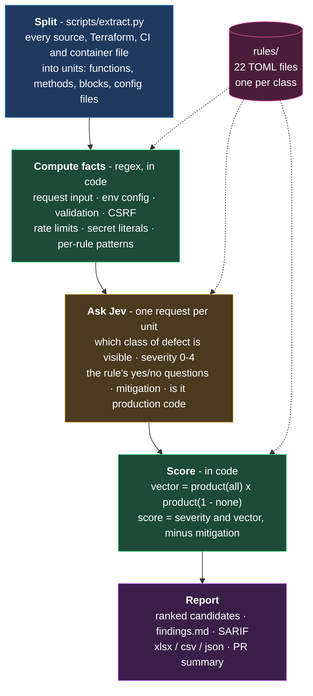

# code-audit-jev

Unit-level security judgment of source code with TypeSafe's Jev. Splits a
repository into functions, methods, Terraform blocks, CI jobs and container
files; asks Jev a fixed set of typed questions about each unit; scores the
answers in code; writes a ranked candidate list, a PR summary and SARIF.

Jev is a System One model: it returns calibrated probabilities to typed
questions about a JSON state. It does not generate text, does not follow a
call into another file, and reads literally. Every row it produces is a
candidate for a person or a reasoning agent to trace. Absences, cross-file
relationships and lifecycle bugs are out of its reach by design; a full
audit or CodeQL covers those.

## What it costs

One Jev request per unit. Every rule's questions ride in that request.

| | Units | Tokens | Cost | Model time |
|---|---|---|---|---|
| A typical PR | 20-80 | 150k-600k | $0.01-0.03 | 1-3 s |
| A 300k-line repository, whole tree | 5,273 | 28M | $1.18 | 5.5 min |

Measured numbers, including the comparison against a full multi-agent audit,
are in `references/methodology.md`.

## Run it

Requirements: Python 3.11+, a TypeSafe API key (`TYPESAFE_API_KEY` in the
environment or `~/.config/typesafe/env`). No packages to install.

```bash
# whole tree
python3 scripts/run.py --target /path/to/repo --app app.md --out out/

# a change: only the units it touched, judged on both sides of the merge base
python3 scripts/run.py --target /path/to/repo --app app.md --diff origin/main \
  --sarif out/jev.sarif --summary out/summary.md

# a folder of repositories: one run each, plus fleet.csv
python3 scripts/run.py --target /path/to/repos --app app.md --out out/

# one unit, with the exact state Jev saw and every answer
python3 scripts/run.py --target /path/to/repo --app app.md --explain src/handlers/auth.py:login

# your own rules beside the built-in ones
python3 scripts/run.py --target /path/to/repo --app app.md --rules .jev/rules
```

`--dry-run` lists the units and the token estimate without calling Jev.
`--exclude PREFIX` skips vendored or archived trees. `--scope signals`
judges only units with a regex signal or a security-relevant role.

## Run it on every pull request

```yaml
on:
  pull_request:
permissions:
  contents: read
  security-events: write
  actions: read
jobs:
  jev:
    runs-on: ubuntu-latest
    steps:
      - uses: actions/checkout@<sha>
        with: { fetch-depth: 0 }                 # the merge base needs history
      - id: jev
        uses: SecurityMindedSolutions/ai-skills/skills/jev/code-audit-jev@<sha>
        with:
          typesafe-api-key: ${{ secrets.TYPESAFE_API_KEY }}
          app: .jev/app.md
          rules: .jev/rules                      # optional
          exclude: archive vendor
      - if: steps.jev.outputs.ran == 'true'
        uses: github/codeql-action/upload-sarif@<sha>
        with:
          sarif_file: ${{ steps.jev.outputs.sarif-file }}
          category: code-audit-jev
```

On `pull_request` the action judges only changed units and reports the ones
whose risk band rose in the PR; a defect already on the base branch is not
the PR's finding. Findings never fail the step. An API refusal (no credits,
bad key) does. Without a key the step exits 0 with a notice, which is what
happens on fork PRs. Store the key as a repository or organization secret.

## How it works



Jev reads **one unit at a time**. It cannot follow a call into another file, so
a flagged unit is a candidate to trace, not a confirmed vulnerability, and a
clean unit means "nothing visible in this unit", not "safe".

1. **Inventory** (`scripts/inventory.py`). Walks the target. Classifies each
   file by language and role: `http_handler`, `event_worker`,
   `shared_library`, `frontend`, `infra_terraform`, `infra_manifest`,
   `ci_pipeline`, `container`, `script`, `config`. Skips tests, docs,
   generated code, lockfiles, binaries, `node_modules` and real virtualenvs.
   A folder whose children contain `.git` is treated as a fleet.
2. **Extraction** (`scripts/extract.py`). Splits each file into units.
   Python: `ast` (functions, methods, class bodies, the module top).
   TypeScript, JavaScript, Go, Java, Rust, Terraform: brace depth at column 0,
   with per-line quote parity so an apostrophe in JSX text does not swallow a
   brace. YAML, Dockerfile, shell: one unit per file. Units over ~4.4k tokens
   are chunked. A comment or import run between blocks is folded into the
   next block; a code fragment (a constant) stays its own unit.
3. **Signals** (`rules/*.toml`, `[signals.*]`). Regexes run against each
   unit. A hit becomes a fact with a line number in the state, for example
   `code_signals.injection.command_exec = "shell / command execution (line 41)"`.
   Jev is told the fact, not asked to spot it.
4. **Judgment** (`scripts/rules.py`, `scripts/run.py`). One request per unit:

   ```json
   {"app":  "<one paragraph about the system>",
    "file": {"path": "...", "language": "python", "role": "http_handler",
             "imports": ["..."], "guard_markers": ["@login_required"]},
    "unit": {"name": "download", "kind": "function", "lines": "47-51", "code": "..."},
    "code_signals": {"path_traversal": {"file_path_build": "file path built from a value (line 50)"}}}
   ```

   with one Choice (which rule class, or none), one Noul per declared
   question (29 with the built-in rules), and one Score (impact, five
   levels). Jev evaluates them in parallel against the one state.
5. **Composition** (`scripts/rules.py`, constants in `rules/_core.toml`).
   Each rule's vector is `product(all) × product(1 − none)` over its
   questions, so "missing authorization" is
   `handles_external_request × privileged_operation × (1 − auth_check_present)`,
   multiplied in code. Then:

   ```
   score = 100 × (0.5 × severity/4 + 0.5 × strongest_vector × (1 − 0.5 × mitigation_in_unit))
   ```

   Bands: Clean < 25 ≤ Note < 50 ≤ Review < 75 ≤ Likely. Attention is score
   ≥ 50 with a category, or a rule's floor (a provider-shaped credential
   literal that Jev also calls a credential). Units Jev calls test or
   non-production code are dropped. A class choice contradicted by its own
   vector is ignored; a fallback to the strongest vector needs that vector
   ≥ 0.5.
6. **Diff mode** (`scripts/diff.py`). Changed files since the merge base are
   split on both sides; a unit is changed when it is new or its code differs.
   The head version is judged; the base version only when the head scored
   above Clean. A row is reported when its band rose.
7. **Output** (`scripts/output.py`). `results.json`, `results.csv`,
   `findings.md` (one entry per file and category with the snippet, for a
   tracing agent), `pr-summary.md`, SARIF 2.1.0 (one rule per class, level
   from band), `results.xlsx` if openpyxl is installed.

## Rules

Every category is one file in `rules/`. The runner knows nothing about any
category.

```toml
id = "ssrf"
title = "Server-side request forgery"
class = """`unit.code` makes an outbound request whose destination ..."""   # the Choice option

[vector]
all = ["outbound_destination_from_input"]      # multiplied
none = []                                      # multiplied as (1 - p)

[questions.outbound_destination_from_input]    # a Noul; ids are global
instructions = """Does `unit.code` make an outbound HTTP ... ?"""
true = """An outside value is used to build the outbound URL and ..."""
false = """The outbound destination is a constant, configuration, ..."""

[signals.outbound_http]                        # regex facts, TOML literal strings
label = "outbound HTTP call"
patterns = ['''requests\.(get|post)\(|\bfetch\(|axios\.\w+\(''']

[floor]                                        # optional
signal = "credential_literal"
labels = ["AWS access key id", "private key block"]
min = 0.5
```

Built-in rules: injection, missing_authorization, tenant_isolation, idor,
secret_exposure, ssrf, open_redirect, csrf, path_traversal,
upload_validation, unsafe_deserialization, xml_xxe, nosql_ldap_injection,
mass_assignment, weak_cryptography, session_and_token_handling,
information_disclosure, xss, resource_exhaustion, insecure_configuration,
supply_chain, unsafe_deletion.

To add a rule, add a file. To change one for a repository, put a file with
the same `id` in the repository's own rules folder and pass `--rules`. To
change a weight or threshold, edit `rules/_core.toml`. `rules/README.md`
covers the format and how to word a question Jev answers well.

## The `app` paragraph

`--app` is one paragraph about the system. It is the only context Jev has
beyond the unit and its file's imports and guard names. State:

- how requests are authenticated, and whether a framework gate covers every
  handler or each handler must guard itself;
- how tenants or customers are isolated and where the tenant id comes from;
- which inputs are trusted (environment, CI substitutions) and which
  resources are public on purpose;
- which sanitizers, pinned HTTP clients and body-size caps exist, and where
  operator-run scripts live.

A false positive caused by a control in another file is fixed by a sentence
here, not by a question change. `mock-data/sample-repo/app.md` is an
example.

## Reading the output

A real run against the bundled mock repository - 10 files, 403 lines, 49 units,
3.2 seconds, 374k input tokens, **1.6 cents**:

```
Likely  97.0  supply_chain               Dockerfile:1-7                      [unpinned_supply_chain, insecure_infra_setting]
Likely  93.0  insecure_configuration     infra/storage.tf:25-31              google_project_iam_member.worker_owner
Likely  90.3  unsafe_deserialization     api/handlers/documents.py:72-77     restore_snapshot
Likely  89.9  injection                  api/handlers/documents.py:64-69     convert
Likely  88.5  path_traversal             api/handlers/documents.py:47-51     download
Likely  86.0  ssrf                       api/handlers/documents.py:80-84     forward_metrics
Likely  84.8  weak_cryptography          api/services/auth.py:38-40          make_reset_token
Review  73.1  tenant_isolation           api/handlers/documents.py:31-37     get_document
Review  72.3  unsafe_deletion            api/services/cleanup.py:9-13        purge_org_files
Review  51.2  csrf                       api/handlers/extras.py:28-31        delete_via_link

49 units: Likely 22, Review 8, Note 5, Clean 14   |   29 attention
```

Each row carries its full reasoning. One finding in JSON:

```json
{
  "path": "api/handlers/documents.py", "unit": "restore_snapshot", "lines": "72-77",
  "category": "unsafe_deserialization", "class_confidence": 1.0,
  "score": 90.3, "band": "Likely", "attention": true,
  "severity_level": "High", "severity_expectation": 3.4, "severity_confidence": 0.59,
  "signals": ["unsafe_deserialization", "upload_unvalidated", "untrusted_reaches_sink",
              "handles_external_request", "privileged_operation"],
  "vectors": {
    "unsafe_deserialization": 0.99, "upload_validation": 0.98, "injection": 0.97,
    "resource_exhaustion": 0.67, "tenant_isolation": 0.378, "csrf": 0.361, "xss": 0.02
  }
}
```

`vectors` is every rule's score for this unit, not just the winner. A unit that
scores 0.99 on one rule and 0.97 on another is genuinely both, and the ranked
list shows only the strongest - open `results.json` when a finding looks
mis-filed, because the second vector is often the better description.


| Column | Meaning |
|---|---|
| Attention | score ≥ 50 with a category, or a floor |
| Category | Jev's class choice when confident, else the strongest vector; `none`, `dropped` (test / non-production) |
| Score, Band | as defined above |
| Signals (Jev) | defect questions answered ≥ 0.5, strongest first |
| Code signals | regex facts with line numbers |
| Mitigation P | probability the unit itself defeats the defect |
| Was, Rose | diff mode: the base band, and whether the band rose in this change |

## Regression set

`mock-data/sample-repo/`: a fictional Flask + React + Terraform + GitHub
Actions portal with 27 labelled defects (`labels.csv`) across all 22 rules and
17 hard negatives (`negatives.csv`).

```bash
cd mock-data/sample-repo
python3 ../../scripts/run.py --target . --app app.md --exclude labels.csv --exclude negatives.csv --exclude app.md --out /tmp/jev
python3 ../../scripts/compare.py --results /tmp/jev/results.json --reference labels.csv
```

Expected: 27/27 flagged, 16/17 negatives quiet, about $0.02. Run it after
any change to a rule.

## Limits

- One unit at a time. A guard in a route table, a pinned client in a
  transport module, a body cap in framework config: invisible unless `app`
  says so.
- Jev believes comments. A file whose comments call it a test fixture is
  dropped as non-production code.
- Regexes are lists. A sink with no pattern is still judged from the code,
  without the fact in `code_signals`.
- Context is 32k tokens of state plus the longest question; units are
  capped well below that.
- English-first.

## Data handling

Each request sends one unit's source, the file's import lines and guard
names, and the `app` paragraph to `api.typesafe.ai`. Nothing else leaves
the machine. Jev is not trained on requests. Outputs default to the system
temp directory.
