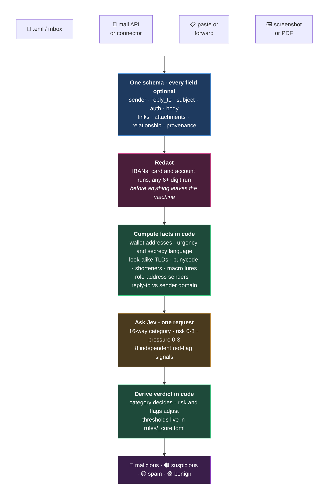

# Jev Email Analysis

Intent classification for email, as an Agent Skill.

SPF, DKIM and DMARC tell you whether a message is what it claims to be. Attachment sandboxing
tells you whether it carries a payload. Neither tells you what the message is *trying to get
someone to do* - which is why a compromised vendor mailbox passes every check you own. This skill
asks that one question and returns it typed.

You do not run it. You ask your assistant something like *"is this phishing?"* or *"triage these
for me"*, hand it the mail in whatever form you have - a forward, an `.eml`, a screenshot, a
mailbox connector - and it does the rest. `SKILL.md` tells it how.

> **Research proof of concept.** A second reader for an analyst, **not a mail gateway**.
> `malicious` means "verify out of band before acting", not "block the sender". `benign` means
> "nothing in what you sent stood out", not "this message is safe". It performs no
> authentication, no DNS and no detonation - give it those results as evidence. Everything in
> `mock-data/` and `evals/` is fictional.

## How it works



Code does everything that can be *decided*. Jev does only the part that must be *judged*. It
returns calibrated probabilities and generates no text, so nothing has to be parsed back out of
prose, and text inside the email cannot argue with it.

## What comes back

A vendor payment-fraud lure - plausible look-alike domain, passing authentication on *its own*
domain, reply-to elsewhere, no history:

```json
{
  "verdict": "malicious",
  "flags": ["asks_payment_change", "secrecy_or_channel_switch", "identity_inconsistent"],
  "answers": {
    "category": "vendor_payment_fraud",
    "category_conf": 1.0,
    "risk": 2.83,  "risk_level": "high - clearly malicious or fraudulent",
    "pressure": 2.02, "pressure_level": "strong - deadline or consequence stated",
    "identity_consistent": 0.06,
    "asks_payment_change": 0.99,
    "requests_credentials": 0.05,
    "secrecy_or_channel_switch": 0.51,
    "brand_or_exec_impersonation": 0.16,
    "targets_ai_reader": 0.05
  },
  "latency_ms": 644
}
```

Note what the deterministic checks would have said: **SPF, DKIM and DMARC all pass**. They pass
for `acme-events-billing.co`, which is not the vendor. The verdict comes from the ask.

Every category carries its full probability distribution (`category_probs`), so a 0.55/0.40 split
between two threat categories is visible rather than flattened into one label.

### Across a batch

What your assistant reports back, attention-first:

| Subject | Verdict | Category | Conf | Risk | Flags |
|---|---|---|---|---|---|
| URGENT: Updated remittance details | 🔴 malicious | `vendor_payment_fraud` | 1.00 | high | payment change, secrecy, identity mismatch |
| Your mailbox storage is full - action required | 🔴 malicious | `credential_harvest` | 1.00 | high | credentials, **identity unknown** |
| Hi | 🟠 suspicious | `reconnaissance` | 1.00 | elevated | identity mismatch |
| Coffee or lunch? | 🟡 spam | `cold_outreach` | 1.00 | low | identity mismatch |
| [Action may be required] Runtime end-of-life notice | 🟢 benign | `legitimate_business` | 0.98 | low | none |
| Re: Thursday's planning session | 🟢 benign | `legitimate_business` | 0.99 | benign | **identity unknown** |

Rows three, five and six are the ones worth studying. A one-word subject from an unknown
free-mail address reads as `reconnaissance` and caps at suspicious. The relayed cloud notice
arrives as `"'Name' via group" <group@your-domain>`, a shape that trips naive impersonation
logic, and still reads as benign. Row six is a **screenshot with no headers at all**, and stays
benign rather than being punished for what the screenshot could not carry.

## Partial input is the normal case

Most tooling assumes full headers. In practice mail reaches an analyst as a forward, a
screenshot, or an API result with no `Authentication-Results` anywhere. So:

**A field that was not captured is unknown - never evidence against the sender.**

Enforced twice, so it does not rest on a model remembering it. The rules tell Jev to withhold
rather than answer *false* on absent signals; and `identity_assessable()` checks **in code**
whether any identity evidence (`auth` or `relationship`) was supplied at all. When none was, the
result carries `identity_unknown` instead of `identity_inconsistent`, and cannot escalate a
verdict by itself.

Without that guard, every header-free source turns routine mail suspicious. Jev answers
`identity_consistent` low for *unsupported*, which is indistinguishable from *contradicted*. On a
field check of 23 real messages with no auth data it was the difference between **2 false alarms
and 0** - and neither was visible to the synthetic controls, because anyone writing a control
writes a complete one. Contrast rows two and six in the table above: both have
`identity_unknown`, and the content decides which way each goes.

One operational rule follows: record `auth` as `"not recorded"`, never `"fail"`, for a check that
was not performed. A NULL auth column in a log export is missing data, not a DMARC failure.

## Categories and signals

`legitimate_business` · `vendor_payment_fraud` (BEC) · `fake_invoice` · `executive_impersonation`
· `payroll_diversion` · `credential_harvest` · `oauth_consent_phish` · `malware_delivery` ·
`callback_phishing` (TOAD) · `qr_phishing` · `extortion` · `advance_fee_or_prize` ·
`reconnaissance` · `spam_marketing` · `cold_outreach` · `none_fits`

`reconnaissance` caps at `suspicious` - it is the setup, not the attack. `spam_marketing` and
`cold_outreach` both roll up to `spam`: a role address broadcasting versus a named person
prospecting.

The eight signals are answered **independently of the category**, because they are worth knowing
either way - "does this ask for a payment change" matters whether the mail lands on
`vendor_payment_fraud` or `legitimate_business`:

`asks_payment_change` · `requests_credentials` · `asks_to_open_or_run` · `asks_to_call` ·
`secrecy_or_channel_switch` · `brand_or_exec_impersonation` · `identity_consistent` ·
`targets_ai_reader`

That last one is prompt injection written into a body for a machine to read. It is reported even
when everything else is clean, because increasingly something other than a person reads the
mail first.

## Rules are a folder you can extend

Every category is one TOML file: the option Jev chooses between, the verdict it rolls up to, and
its regex facts. `_core.toml` holds the shared questions, the scales, the verdict thresholds and
the facts every email gets. The analyzer knows about none of it - even the
malicious/spam/benign mapping comes from the rule files.

```toml
id = "vendor_payment_fraud"
title = "Vendor payment fraud (BEC)"
verdict = "malicious"

class = """BEC via a vendor/supplier: changed or new bank details, redirected remittance...
Needs a concrete sign of changed payment details or an identity mismatch; an ordinary quote,
invoice or order thread with an established, authenticated vendor is legitimate_business."""

[signals.bank_details]
label = "new or changed bank details"
patterns = ['''(?i)\b(new|updated|changed|revised)\s+(bank|account|remittance|wire|beneficiary)''']
```

Point the skill at your own folder and a file whose `id` matches a built-in category **replaces**
it, a new `id` **adds** one. Retune `vendor_payment_fraud` for how your AP process actually
works, or add the category your sector sees and nobody else does - no fork.

Most of the accuracy lives in those `class` strings, specifically in the sentence saying what does
*not* count. An ordinary invoice from an authenticated vendor is not BEC; a vague subject from a
marketer is `cold_outreach`, not `reconnaissance`. Boundaries are where this is won or lost.

## Results

**Controls** - 27 synthetic emails, at least one per category, including deliberately hard
legitimates (a real vendor invoice, an authenticated Microsoft alert, a genuine DocuSign, a
relayed cloud notice), both sides of the cold-outreach/reconnaissance line, and four
degraded-input cases: **category 26/26, verdict 26/26**, every labelled signal in agreement.

**Field check A** - 301 real messages, metadata only, four tuning iterations: 80.4% → 93.4%
strict, 73 → 1 false alarms, 0 misses.

**Field check B** - 23 real messages, full bodies, no auth data at all:

| | strict | lenient | false alarms | misses |
|---|---|---|---|---|
| as shipped | 87.0% | 95.7% | 2 | 0 |
| + identity-assessable guard | 87.0% | 95.7% | **0** | 0 |
| + rules folder and code signals | 82.6% | **100%** | 0 | 0 |

Strict fell in the last row because three messages moved across the
`legitimate_business`/`spam_marketing` line - both harmless, same verdict, so nothing a reader
is told actually changed.

**What these numbers do not cover.** Check B contained no threats: the mailbox's spam folder held
57 messages the connector would not return, so that run measures false alarms and nothing else.
Threat recall rests on the controls and check A. n=23 is enough to find a systematic mechanism -
it did - and not enough for a confidence interval. Both field checks are single mailboxes in one
industry. `references/methodology.md` keeps the full accounting, including the known soft spots.

**Cost** - about 2,500 input tokens and a few hundred milliseconds per email; a fraction of a
cent. Cheap enough to run on every message in a mailbox.

## Requirements

A TypeSafe API key in `TYPESAFE_API_KEY` or `~/.config/typesafe/env`
([console.typesafe.ai/keys](https://console.typesafe.ai/keys)), and Python 3.11+. No
dependencies - standard library only. If no key is present the skill reports itself skipped
rather than failed, so it can sit in a pipeline that does not always have credentials.

Optionally tell it who the recipient organisation is, which sharpens internal-impersonation and
look-alike judgments. Nothing organisation-specific is stored in the skill itself.

## Reading further

[`references/schema.md`](references/schema.md) is the input contract - every field, what it adds,
and what happens when it is missing. [`rules/README.md`](rules/README.md) is how to write or
retune a category. [`references/methodology.md`](references/methodology.md) is how this was
validated and where it is weak.
