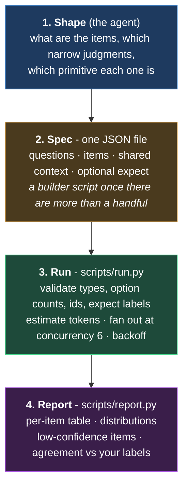

# run-jev

Ad-hoc typed judgments over a list of things with TypeSafe's Jev, from inside
a Claude Code session. You describe what you want judged; the agent turns it
into `choice` / `noul` / `score` questions with written criteria; a small
stdlib runner sends one request per item in parallel; a reporter turns the
answers into a markdown table, per-question distributions, the low-confidence
items, and, when you already have labels, the agreement rate and every
disagreement with the probability Jev gave your answer.

Jev is a System One model: it returns calibrated probabilities to typed
questions about a JSON state. It does not generate text and it does not
invent categories. It selects among the options you give it and tells you how
sure it is. That makes it a fast, cheap second reader over a list, not an
oracle: typed output guarantees the shape of an answer, not its truth. Spot
check a handful of high-confidence answers against the source before acting
on a batch, and treat a 0.5 as "no idea", not "somewhat".

## How it works



1. **Shape.** The agent decides what the items are, which narrow judgments to
   ask per item, which primitive each one is, and what compact state each
   item needs. If you have your own labels they go in as `expect`.
2. **Spec.** One JSON file: `questions`, `items`, optional `context` shared by
   every item. For more than a handful of items the agent writes a short
   builder script; `examples/build_spec_from_python_modules.py` is the pattern
   for "one item per file in a tree", summarizing each file by AST so a
   3,500-line module still fits comfortably under the per-request cap.
3. **Run.** `scripts/run.py` validates the spec (types, option counts, unique
   ids, `expect` labels that exist), estimates tokens, warns per item over
   the ~6k soft cap, then fans out at concurrency 6 with backoff on
   429/529/5xx. Per-item errors are recorded, not fatal.
4. **Report.** `scripts/report.py` prints markdown and optionally a CSV.

## Usage

Inside Claude Code: `/run-jev categorize the modules under src/services
into these groups ...` or any phrasing that names Jev. The agent does the
rest and shows you the questions it asked.

By hand:

```bash
python3 scripts/run.py spec.json results.json --dry-run     # validate + token estimate
python3 scripts/run.py spec.json results.json --limit 5     # sanity-check a few first
python3 scripts/run.py spec.json results.json
python3 scripts/report.py results.json --sort my_group --low-q my_group --csv out.csv
```

Requirements: Python 3.10+, a TypeSafe API key in `TYPESAFE_API_KEY` or
`~/.config/typesafe/env`. No packages to install.

The spec format and validation rules are in `references/spec-format.md`; the
wire contract, primitives and how to read the numbers are in
`references/primitives.md`.

## Output

Markdown, printed. Here is a real run: the 45 Python modules of the six Jev
skills in this repository, asked what role each plays in its pipeline, whether
it calls the model itself, and how much reviewer attention it needs. Nothing
was given but each module's docstring, public symbols and imports.

```
## Jev run: 45 items, 3 questions, model jev-latest, 46,669 input tokens, 2.8s, 0 errors

| id                   | role                      | asks_the_model | complexity                      |
|----------------------|---------------------------|----------------|---------------------------------|
| jev_analyze          | orchestration (0.48)      | 0.57           | heavy (2.55, c=0.55)            |
| traffic_classify     | scoring (0.58)            | 0.57           | moderate (1.96, c=0.89)         |
| code_rules           | question_definition (0.80)| 0.17           | moderate (2.34, c=0.6)          |
| jev_jev              | model_client (1.00)       | 0.80           | moderate (1.85, c=0.81)         |
| traffic_profile      | feature_extraction (1.00) | 0.13           | moderate (1.95, c=0.91)         |
| resume_report        | reporting (1.00)          | 0.08           | small (1.22, c=0.72)            |
| ... 39 more rows

### Distributions
- **role** (choice): orchestration 10, feature_extraction 8, model_client 8,
  ingest 5, question_definition 5, reporting 5, scoring 4
- **asks_the_model** (noul): 15/45 > 0.5; mean p = 0.29
- **complexity** (score): moderate 27, small 15, heavy 3

### Low confidence (< 0.8), 11 answers, least confident first
- `code_compare`  **role** c=0.37: scoring 0.45, orchestration 0.32, reporting 0.18
- `jev_analyze`   **role** c=0.48: orchestration 0.55, scoring 0.43, none_fits 0.01
- `code_diff`     **role** c=0.49: feature_extraction 0.56, ingest 0.41, orchestration 0.01
- `traffic_classify` **role** c=0.58: scoring 0.65, orchestration 0.33, model_client 0.02
```

Four things to notice, because they are what this output is for:

- **It recovered the architecture.** Every one of the six skills is built as
  ingest → feature extraction → model client → question definition → scoring →
  reporting → orchestration, and the run sorted 45 files into those stages from
  docstrings and imports alone.
- **The low-confidence section is the useful one.** `jev_analyze` split 0.55
  orchestration / 0.43 scoring, which is correct and is a real observation about
  that file: it owns the entry point *and* the verdict rules. A near-0.5 split
  means the item is ambiguous, not that the model is weak.
- **Noul columns are probabilities, not labels.** `asks_the_model` at 0.57 for
  `jev_analyze` is a genuine "partly": it builds the request but a client module
  sends it.
- **With `expect` labels**, two more sections appear: agreement per question, and
  a disagreement table giving Jev's pick, its confidence, your label, and the
  probability Jev gave *your* label. A disagreement where your label got 0.03 is
  worth opening the source; one where it got 0.45 is a coin flip.

## Cost and time

$0.042 per million input tokens at last check. A representative run:

| Items | Questions each | Input tokens | Cost | Wall time |
|---|---|---|---|---|
| 75 Python modules, summarized by AST | 8 | 175k | under $0.01 | seconds |

## Results

First use: categorizing 75 flat service modules of a Python monorepo into a
proposed 12-package layout, with the agent's own assignment as `expect`.
Jev agreed on 71/75 (72/75 after one criteria description was sharpened).
The disagreements were all low-confidence on Jev's side, which located the
ambiguity in the modules rather than the taxonomy, and one of them
(a purge job the agent had filed as a vendor client, 0.03 for that package)
was a real correction that was adopted. Four extra axes the agent had not used (architectural tier,
primary actor, data scope, I/O nouls) were asked in the same run and
clustered in code; the tier clustering independently identified the
orchestrator modules responsible for every cross-package import cycle.
