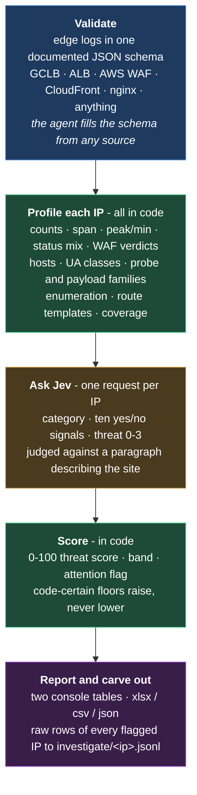

# Traffic Triage Eval

Per-IP triage of edge logs. Every client IP in a load-balancer or WAF export
gets a category (who it is), a 0-100 threat score with a band (how much it
matters), the signals behind both, and its raw rows carved out if it needs a
look. Built on TypeSafe's Jev; code does the counting, Jev does the judgment.

> Research proof of concept. A triage signal, not a detection: `malicious`
> means read the requests, not block the address; `benign_user` means
> nothing stood out. Verify in the raw rows before acting. Everything in
> `mock-data/` is fictional.

## How it works

Jev never counts and never reads a timestamp. Everything numeric and temporal
is settled in code before it is asked what the pattern means.

## What it does

1. **Validate** a JSONL export in one documented schema
   ([`references/schema.md`](references/schema.md)). Required: `ts`, `ip`,
   `method`, `path`. Optional and worth sending: `status`, `host`, `query`,
   `ua`, `referer`, `waf_action`, `waf_rule`, `waf_labels`, `asn`, `country`,
   `ja3`/`ja4`. The validator prints which fields are populated. WAF-only
   exports with no response status are fine.
2. **Profile each IP in code**: counts, time span, peak per minute, status
   mix, WAF verdicts and labels, hosts, User-Agent classes, probe-path
   families, payload families, route templates, directory and extension
   rollups, enumeration templates, and short samples of what the rules did
   not already describe.
3. **Ask Jev** one request per IP: a category choice, ten yes/no signals,
   and a four-level threat rating, all judged against a paragraph describing
   the site.
4. **Score and decide in code**: a 0-100 score, a band, the category with
   code-certain floors applied, and an attention flag.
5. **Report**: two console tables, `results.xlsx` / `.csv` / `.json`, and
   `investigate/<ip>.jsonl` for every malicious, unclear or flagged IP so the
   follow-up never re-queries the log source.

The retrieving agent gets the logs into the schema however the environment
allows (CLI, MCP, Athena, SIEM export). The skill does not fetch logs.

## What the output looks like

The mock set: one synthetic day, 33 labelled IPs. Summary table:

| Requests | IPs | malicious | background_scan | ai_agent | benign_bot | benign_user | unclear | Benign | Nuisance | Concerning | Attack | Attention |
|---:|---:|---:|---:|---:|---:|---:|---:|---:|---:|---:|---:|---:|
| 3,689 | 33 | 9 | 7 | 5 | 8 | 3 | 1 | 16 | 8 | 2 | 7 | 9 |

A selection of rows (the run prints attention and malicious rows; the sheet
has every IP):

| IP | Category | Score | Band | Attention | Req | Signals | Code signals | Top paths |
|---|---|---:|---|---|---:|---|---|---|
| 194.26.29.4 | malicious | 87.7 | Attack | YES | 60 | exploit_payloads, app_aware, enumeration | payloads, waf_denied, enumeration | 22x /api/v1/trust/documents; 20x /api/v1/tenants/acme/documents |
| 103.99.1.7 | malicious | 76.6 | Attack | YES | 300 | automated, app_aware, enumeration | ua_script, enumeration | 300x /api/v1/trust/pages |
| 5.188.86.2 | malicious | 73.8 | Concerning | YES | 420 | credential_attack, app_aware, automated | waf_throttled, auth_volume, burst | 420x /api/v1/auth/signin-password |
| 89.248.165.2 | malicious | 68.8 | Concerning | YES | 46 | app_aware, enumeration | enumeration | 1x /; 1x /api/v1/auth/user_info |
| 45.155.205.10 | background_scan | 25.7 | Nuisance | | 18 | generic_probing, wrong_host, scanner_tool | probe_paths, raw_ip_host | 2x /wp-login.php; 2x /xmlrpc.php |
| 87.120.104.29 | background_scan | 25.8 | Nuisance | | 30 | wrong_host, automated | waf_denied | 30x / |
| 20.171.207.1 | ai_agent | 20.1 | Benign | | 80 | ai_operated, declared_bot | ua_ai_agent | 21x /acme/faq; 17x /acme/documents |
| 44.201.1.9 | ai_agent | 24.0 | Benign | | 21 | ai_operated, declared_bot | ua_ai_agent | 18x /mcp; 1x /api/v1/auth/oauth/register |
| 66.249.66.1 | benign_bot | 14.4 | Benign | | 60 | declared_bot, automated | ua_crawler | 13x /api/v1/trust/pages; 11x /acme |
| 216.144.248.20 | benign_bot | 7.2 | Benign | | 1440 | monitoring, declared_bot | ua_monitor | 1440x / |
| 203.0.113.10 | benign_user | 22.8 | Benign | | 56 | app_aware | | 6x /; 6x /assets/index-8f2a1c.js |
| 198.18.0.1 | unclear | 7.0 | Benign | | 1 | app_aware | | 1x / |

Columns: **Category** is who. **Score** and **Band** are how much it matters.
**Attention** is the read-first flag. **Signals** are Jev's yes/no answers at
0.5 or above. **Code signals** are what regex and counting established before
Jev was asked. The Details sheet adds every probability, the category
distribution, the rule reasons, tokens and latency.

## Categories and bands

| Category | Means |
|---|---|
| `benign_user` | A person in a browser or the product's own client |
| `benign_bot` | Declared, well-behaved automation: crawlers, monitors, schedulers, a customer's script on entitled routes |
| `ai_agent` | AI crawler or agent: GPTBot, ClaudeBot, Claude-User, ChatGPT-User, PerplexityBot, an MCP client, a browsing agent |
| `background_scan` | Internet scanning: `.env`, `.git`, `/proc/self/environ`, WordPress, PHP, backups, raw-IP hosts, mass exploit sprays. No knowledge of this application, however many hosts or User-Agents it uses |
| `malicious` | An attack on this application: payloads on real routes, credential attempts on real auth endpoints, enumeration of real ids, recon of real routes |
| `unclear` | Too little evidence, or a spread distribution |

| Band | Score | Means |
|---|---|---|
| Benign | 0-24 | Ordinary use, declared bots, monitors |
| Nuisance | 25-49 | Scanning for things this site does not have, all rejected |
| Concerning | 50-74 | Recon of real endpoints, sign-in attempts, WAF denials on real routes, enumeration |
| Attack | 75-100 | Payloads against real endpoints, credential attacks at volume, enumeration returning successes |

The line between `background_scan` and `malicious` is knowledge of this
application. Both can carry exploit strings.

## Methodology

**Code counts, Jev judges.** Jev's documented weak spots are counting,
arithmetic, dates, and large states full of irrelevant detail. Edge logs are
all of those. So `profile.py` reduces an IP's rows to a compact profile with
every number computed in code and every number paired with a sentence
("hundreds of requests over about 3 hours, in aggressive bursts"), and
`signals.py` turns every regex hit (scanner UA, probe family, payload family,
WAF label family) into a named fact. Jev never has to spot a string, only
weigh what the facts mean for the site described in `app.md`.

**Questions** (`questions.py`, the whole policy in one file): one Choice for
the category; Nouls for generic probing, app-aware, exploit payloads,
credential attack, enumeration, automated, declared bot, AI-operated,
monitoring, wrong host, scanner tool; one Score for the threat rating
(Benign / Nuisance / Concerning / Attack). One request per IP, ~3,500 tokens.

**Score** = 100 × (0.45 × rating/3 + 0.35 × strongest_vector × (0.25 + 0.75 ×
app_aware) + 0.10 × app_aware + 0.10 × scanning_pressure), where
strongest_vector = max(exploit_payloads, credential_attack, enumeration) and
scanning_pressure = max(scanner_tool, generic_probing, wrong_host). The
vectors enter as a max because they are mostly mutually exclusive and an
average hides a single-vector attack. The app-knowledge gate is why a `../`
sprayed at the raw IP scores about 45 and the same payload on a real route
scores about 85.

**Floors** (code raises the category, never lowers it): payloads or WAF
attack labels on routes that exist here; credential-attack volume with WAF
evidence on real auth endpoints; scanner UA, probe paths or wrong host with
no app knowledge. Low choice confidence becomes `unclear` unless the split is
between the two benign classes. Fewer than three requests with no code signal
is `unclear`.

**Attention** = score ≥ 50 with a non-benign category, or a floor fired.

**Calibration.** The mock set covers, inside `malicious`: SQLi, XSS,
traversal, SSRF, JNDI, command and template injection, deserialization,
credential stuffing, OAuth registration abuse, tenant enumeration, a nuclei
run, slow recon; plus scanners, AI agents, bots, and hard-negative users (a
curious `/admin` click, a typo 404, a curl user reading `security.txt`, an
MFA retry). Result: malicious personas score 69-88, every benign IP 40 or
below, scanners 26-31, 9/9 attackers flagged, 0 benign flagged. Two days of
real GCP load-balancer logs from three projects (~42k requests, ~1,900 IPs)
drove the regex and criteria fixes recorded in
[`references/methodology.md`](references/methodology.md).

## Cost and time

| | |
|---|---|
| Tokens per IP | ~3,500 median, ~7,300 max |
| Cost | ~$0.15 per 1,000 IPs at $0.042/Mtok; output tokens free |
| Latency | ~340 ms per IP; 8 workers clear 1,000 IPs in about a minute |
| Jev limit | 32k tokens per request (measured: 32,653 accepted, ~36k refused); profiles use 1-8% of it |
| Local | Aggregation is CPU-only; 42k rows profile in under 5 s |

## How to use it

Ask your assistant. *"Who was hitting us last night?"*, *"is this IP an attack
or a scanner?"*, *"triage yesterday's WAF logs"*. It works out the retrieval
with you - a cloud CLI, an MCP server, Athena, a SIEM export, a file you
already have - maps the events into the schema, and runs the rest.

It validates before spending anything and will tell you which optional fields
came through, because a log export missing `ua`, `host` or `query` has lost
most of its signal and is worth fixing before the run rather than after. It can
profile without calling Jev at all, narrow to named IPs or a time window, skip
one-hit addresses, score against your own labels, and dump the full profile and
every answer for a single IP when you want to check a verdict.

Needs Python 3.10+ and a TypeSafe key (`TYPESAFE_API_KEY` or
`~/.config/typesafe/env`). First run creates a private venv for openpyxl.

**`app.md` is the part that matters.** "Knows this application" is judged
against it. Name the hostnames, the route families, the health checks, and what
the site does *not* run (WordPress, PHP, `/admin`). Say if static buckets
return 200 for unknown paths. The difference between "background noise" and
"malicious" is whether the traffic knows your application, and Jev only knows
your application from that paragraph.

## What it gets wrong

- **No reverse-DNS.** A UA claiming Googlebot is believed unless the IP
  rotates identities (`ua_spoofed_bots`).
- **One IP is one actor.** NAT and CDN edges merge many clients; a Cloudflare
  edge IP in front of an origin will score as one scanner.
- **SPA fallbacks.** A bucket that serves the shell for any path makes 404
  rate meaningless there; the probe-family regexes carry the weight.
- **Regexes are lists.** A new scanner UA or probe family is invisible until
  added to `signals.py`. The `unclear` and `benign_bot` rows are where to look.
- **Threshold rows flip.** An IP scoring 49 one run and 51 the next is the
  threshold, not noise; Jev's answers are stable to about a hundredth.
- **Crafted state can move Jev.** A UA string written to argue for its own
  classification can shift an answer; the floors keep a payload on a real
  route malicious whatever the UA says.

